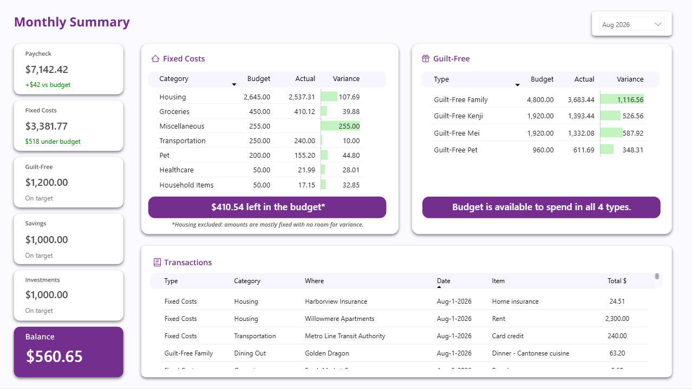
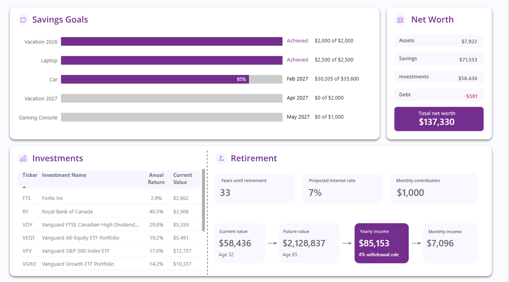
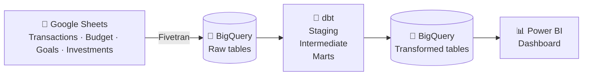

# 💰 Personal Finances Analytics

**An end-to-end data platform that turns a couple's financial transactions into insights about their money.**

Created by Clarissa Yamakita — a portfolio project showcasing an end-to-end analytics workflow.

---

## 🧑‍🤝‍🧑 The story

Meet **Kenji**, a product manager who loves gaming, and **Mei**, a sound designer who brings music into everything she does. They're a couple **stuck in a common money debate**. One wants to invest more for the future, while the other wants to enjoy life today. Neither is wrong — they just need a plan that makes room for both.

This project builds the data pipeline and dashboard that help the couple have more productive conversations about money. It automatically answers the type of questions below — no manual spreadsheet reconciliation required.

1. 🛒 **Enjoy life** — *Can we afford these groceries? Can we book a VR session this weekend?*
2. 🎯 **Achieve goals** — *Which goals are already funded? When can we afford a car?*
3. 🏖️ **Build wealth** — *Will we be okay when we retire? What would our income look like?*

The full story is available in this [Slide Deck](https://tinyurl.com/PersonalFinances-SlideDeck).

> All data shown is **synthetic**, generated with AI to demonstrate the platform. Kenji, Mei, and every transaction, vendor, and account are fictional.

## 📸 The dashboard

**Monthly Summary** — tracks paycheck, fixed costs, guilt-free spending, and every transaction against the budget.

**Savings & Investments** — tracks savings goals, portfolio value, and a forward-looking retirement projection.

Access the [live dashbord here](https://app.powerbi.com/view?r=eyJrIjoiNzc4NmJiZmQtNjk2Mi00MDI0LWFlNTktZTNmYjMxMDJkOGRhIiwidCI6ImQ4ZmYwY2RhLWM0ZjktNDUyMC05NmQ5LWM0NGFlYjViZjlkZSJ9).

## 🧭 How they budget: the Conscious Spending Plan

The dashboard is built around a simple framework for allocating take-home pay, adapted from Ramit Sethi's [*Conscious Spending Plan*](https://www.iwillteachyoutoberich.com/conscious-spending-basics/):

| Bucket | Covers | Target % of take-home pay |
|---|---|---|
| 🏠 Fixed Costs | What you need to live — rent, utilities, groceries, transportation | 50–60% |
| 🎯 Savings | Money you'll use in 1–5 years — emergency fund, vacation, car | 5–10% |
| 📈 Investments | Long-term wealth building — TFSA, RRSP, non-registered accounts | 5–10% |
| 🎉 Guilt-Free | What you love — travel, dining out, clothes, hobbies | 20–35% |

Every transaction is tagged to one of these buckets, which is what lets the dashboard answer "can we afford it?" at a glance.

## 🏗️ How it's built

| Stage | Tool | What happens |
|---|---|---|
| 1. Source | Google Sheets | Transactions, budget targets, savings goals, and investments are logged manually |
| 2. Ingestion | Fivetran | Syncs Sheets → BigQuery automatically, once a day |
| 3. Warehouse | BigQuery | Raw data lands isolated in `src_google_sheets`, keeping it separate from transformed layers |
| 4. Transformation | dbt | Staging → Intermediate → Marts models, with automated tests for primary-key uniqueness, null checks, and relationship integrity |
| 5. Visualization | Power BI | DAX powers running totals, annualized investment returns, and forecasted goal dates |

## 🔍 Explore the project

| What | Where |
|---|---|
| 📋 Google Sheets template | [Google Sheets](https://docs.google.com/spreadsheets/d/1JcsT9pk5fk32Ljm0JsUDgQSIH8mNPSjMwa3npAzKvro/edit?usp=drive_link) or [`Personal Finances - Google Sheets.xlsx` in this repo](assets/Personal%20Finances%20-%20Google%20Sheets.xlsx) |
| 🧱 dbt models (SQL) | [personal_finances_dbt repo](https://github.com/clayamakita/personal_finances_dbt) |
| 📊 Power BI report | [Access it live](https://app.powerbi.com/view?r=eyJrIjoiNzc4NmJiZmQtNjk2Mi00MDI0LWFlNTktZTNmYjMxMDJkOGRhIiwidCI6ImQ4ZmYwY2RhLWM0ZjktNDUyMC05NmQ5LWM0NGFlYjViZjlkZSJ9) or [`Personal Finances - Dashboard.pbix` in this repo](assets/Personal%20Finances%20-%20Dashboard.pbix) |
| 🖼️ Slide deck (project narrative) | [pdf file](https://tinyurl.com/PersonalFinances-SlideDeck) or [`Personal Finances - Slide Deck.pdf` in this repo](assets/Personal%20Finances%20-%20Slide%20Deck.pdf) |